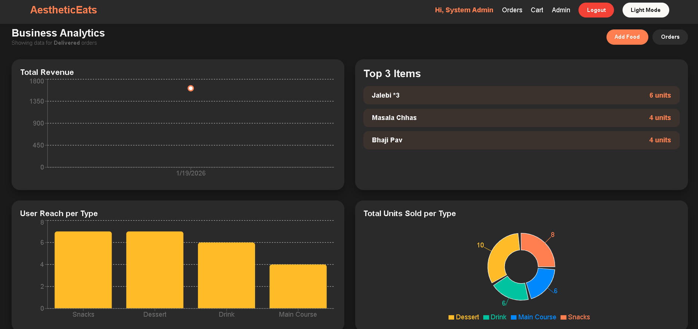
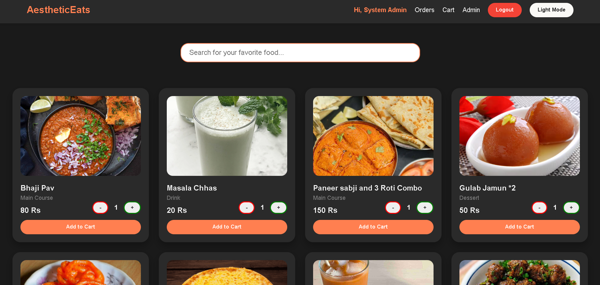

# FoodOrder-MERN

A complete Full-Stack Food Ordering application built with the MERN stack. This project focuses on clean architecture, secure authentication, and data integrity for e-commerce.




## Key Features

* **User Authentication:** Secure Login/Register using JWT and Bcrypt password hashing.
* **Menu Management:** Browse items and add them to a persistent shopping cart.
* **Order System:** Real-time order placement
* **Admin Dashboard:** A protected area for administrators to manage the food menu and view sales analytics.

## Tech Stack

**Frontend:** React.js, Axios 
**Backend:** Node.js, Express.js  
**Database:** MongoDB & Mongoose  
**Auth:** JSON Web Tokens (JWT)


## Getting Started

### 1. Clone the repository
```bash
git clone [https://github.com/your-username/mernRestaurant.git](https://github.com/your-username/mernRestaurant.git)
cd mernRestaurant
```

### 2. Setup the Backend
```bash
cd server
npm install
node index.js
```

### 3. Setup the Frontend
```bash
cd client
npm install
npm run dev
```